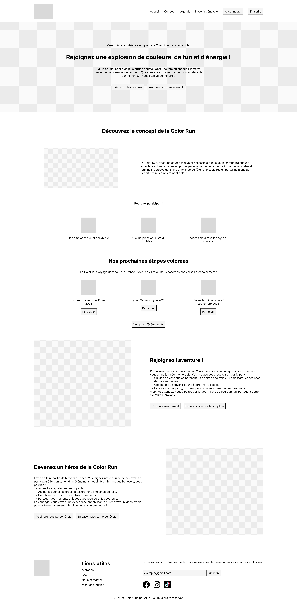
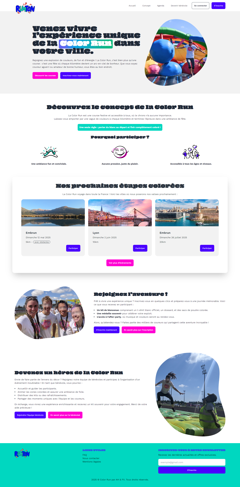

# Intégration avec DaisyUI (landing page fournie)

Ce document accompagne la **landing page HTML** que vous devez intégrer à votre projet. Il vise à vous fournir une base solide pour développer les autres pages de votre site en utilisant **Tailwind CSS** et **DaisyUI**.

-   Wireframe VS intégration HTML (dérouler pour voir)
    
    

---

## Caractéristiques de la Landing Page

1. **Basée sur DaisyUI** :
    - La landing page utilise **DaisyUI**, une librairie de composants Tailwind CSS qui simplifie la création d'interfaces grâce à des composants prêts à l'emploi.
    - Les styles des éléments (boutons, formulaires, cartes, etc.) proviennent des classes spécifiques de DaisyUI.
2. **Personnalisation grâce aux thèmes DaisyUI** :
    - Les couleurs de la page sont définies par le **thème DaisyUI** sélectionné.
    - Vous pouvez facilement personnaliser ces couleurs en modifiant le thème dans le fichier `tailwind.config.js`.
    - DaisyUI propose plusieurs thèmes intégrés que vous pouvez utiliser ou personnaliser selon vos besoins.
3. **Flexibilité et adaptabilité** :
    - Vous êtes encouragés à modifier cette landing page selon vos besoins et préférences.
    - Elle sert de base pour développer les autres pages de votre projet, en maintenant une cohérence visuelle et fonctionnelle.
    - Les libs sont chargées via CDN. Vous êtes encouragés à passer par npm pour l’auto-complétion des classes.
      

---

## Consignes pour le projet

1. **Création des autres pages** :
    - Pour chaque nouvelle page, réalisez un **wireframe** similaire à celui fourni pour la page d'accueil.
    - **Ajoutez le lien de partage du Figma avec tous les wireframes dans les liens utiles du footer.**
    - Ces wireframes serviront de guide pour la structure et la disposition des éléments sur vos pages.
2. **Utilisation de Tailwind CSS et DaisyUI** :
    - Basez-vous sur **Tailwind CSS** et **DaisyUI** pour concevoir les interfaces de vos pages.
    - Utilisez les classes utilitaires de Tailwind pour le style et les composants de DaisyUI pour une mise en page rapide et cohérente.
3. **Réalisation des formulaires de connexion et d'inscription** :
    - Créez des formulaires de connexion et d'inscription en vous appuyant sur les composants de formulaires fournis par DaisyUI.
    - Assurez-vous que ces formulaires sont fonctionnels, esthétiques et adaptés aux différentes tailles d'écran.

---

## Ressources Utiles

-   **Documentation de DaisyUI** : Consultez la documentation officielle pour comprendre comment intégrer et personnaliser les composants.
    [daisyUI](https://v5.daisyui.com/docs/themes/?utm_source=chatgpt.com)
-   **Tutoriels sur les formulaires avec Tailwind CSS et DaisyUI** : Des guides sont disponibles pour vous aider à créer des formulaires élégants et fonctionnels.
    [Tailwind Tap](https://www.tailwindtap.com/blog/tailwind-css-daisyui-form-tutorial?utm_source=chatgpt.com)
-   **Générateur de thèmes DaisyUI** : Utilisez cet outil pour créer des thèmes personnalisés adaptés à votre projet.
    [DaisyUI theme generator](https://www.daisyuitheme.com/?utm_source=chatgpt.com)
